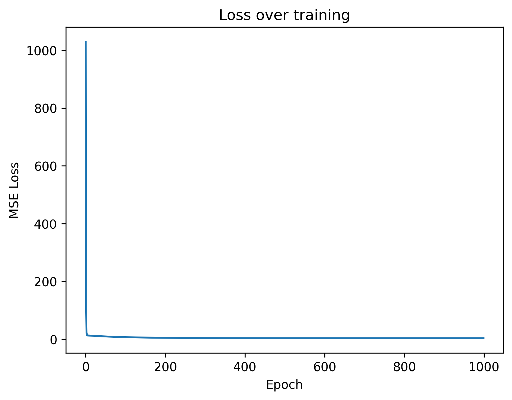
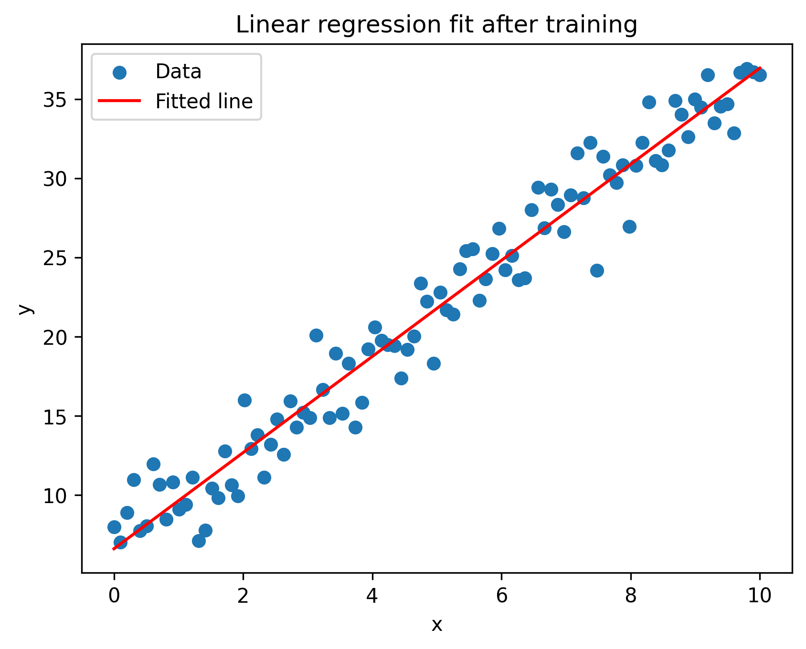

# **Linear Regression From Scratch (NumPy Implementation)**

This project implements **linear regression from scratch** using only **NumPy**, without relying on machine learning libraries like scikit-learn.
The goal is to understand the fundamentals of:

* Data generation
* Matrix shapes and preprocessing
* Prediction function
* Mean Squared Error (MSE) loss
* Gradient computation
* Gradient Descent optimisation
* Parameter convergence
* Visualisation of the learning process

This project demonstrates how linear models learn under the hood.

---

## **Project Overview**

We generate synthetic data from the true relationship:

```
y = 3x + 7 + noise
```

Then we implement:

### Prediction function

Uses matrix multiplication (`X @ w + b`)

### MSE Loss

```math
MSE = (1/n) * Σ (y_pred_i - y_i)^2
```

### Gradients

Computed manually using the derivative of the MSE loss.

### Gradient Descent

Parameters updated using:

```
w := w - learning_rate * grad_w  
b := b - learning_rate * grad_b
```

### Training Loop

Runs multiple gradient descent steps until convergence.

---

## **Training Results**

The model successfully learns values close to the true parameters:

* **True w:** 3
* **True b:** 7
* **Learned w:** ~ 3.03
* **Learned b:** ~ 6.61
* **Final loss:** ~ 3.26

The notebook also includes:


### Loss Curve


### Final Model Fit

  

---

## 📁 **Repository Structure**

```
linear-regression-from-scratch/
│
├── linear_regression_from_scratch.ipynb   # Full implementation
└── README.md                              # Project description
```

---

## **Why This Project Matters**

This project demonstrates understanding of key ML concepts:

* Vectorised NumPy computation
* Implementing models manually
* Understanding gradients & optimization
* Clear, maintainable code
* Using visualisations to evaluate learning

This forms a strong foundation for:

* Logistic Regression
* Neural Networks
* Deep Learning
* Regularisation (Ridge/Lasso)
* Advanced optimisers (Adam, Momentum)

---

## **What I Learned**

* How linear regression works internally
* How gradients drive learning
* How to implement MSE and gradient descent
* How NumPy shapes and broadcasting work
* How to visualise and debug ML code

---

## **Future Improvements**

* Polynomial regression
* Multi-feature regression
* Ridge/Lasso regularisation
* Comparison with scikit-learn
* Stochastic Gradient Descent

---

## **Author**

**Shakur Ahmad**
Aspiring Machine Learning Engineer
GitHub: [shakurahmadd](https://github.com/shakurahmadd)

---

Copy/paste this directly — GitHub will render it perfectly.
